# alert_monitoring - api

## Requisitos

Para poder usar el arquetipo, se debe tener instalado:

- Python 3.12 (También es posible a través de PyEnv) - [Guía de instalación](https://fwk.srv.mercadona.com/framework/python?pathname=/latest/purposes/getting-started/)

## Instalación

Para instalar las librerías necesarias para el arquetipo, usaremos [Poetry](https://python-poetry.org/). En caso de no estar instalado, se debe instalar con `pip3 install poetry`

Cuando ya se disponga de poetry, se instalarán las librerías con el comando `poetry install`

## Variables de entorno

Para que el microservicio pueda funcionar correctamente, se deben cargar las siguientes variables de entorno:
```
ENVIRONMENT -> entorno en el que se va a ejecutar la aplicacion (local, dev, itg, pre, pro)
DATABASE_USERNAME -> usuario de la base de datos a la que se va a conectar el microservicio
DATABASE_PASSWORD -> contraseña del usuario de base de datos
DATABASE -> base de datos a la que se va a conectar el microservicio
DATABASE_HOST -> Host de la base de datos con el puerto, Host:Puerto
SCHEMA_REGISTRY_URL -> URL del Schema Registry
BOOTSTRAP_SERVERS -> Host:Puerto de Kafka
FWK_PATH -> Path a la raiz del framework, en los despliegues se setea de forma automática en el dockerfile pero 
en local hay que configurarlo de forma manual. Por ejemplo, /<path>/<repositorio>/<local>/alert_monitoring/api
 
```

Si usas Google ADK tienes que añadir esta variable de entorno adicional:
```
GOOGLE_GENAI_USE_VERTEXAI=FALSE
```
Y añadir las credeciales de los modelos de LiteLLm que uses. Revisa la documentación del framework y de la librería fwkpy-lib-generative-ai para más información.

En la raíz del proyecto puedes poner el fichero `.env` con las variables de entorno.

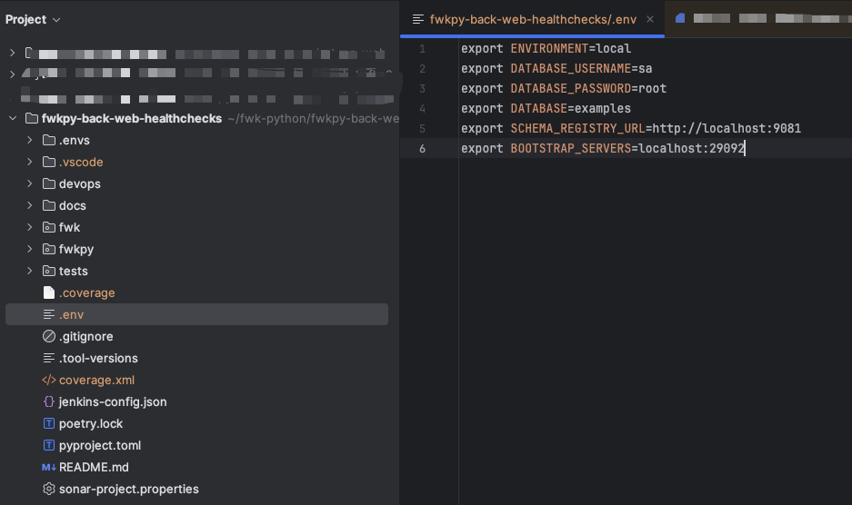

Pueden ser cargadas de varias formas:

- Desde terminal ejecutando lo siguiente:
    ````shell
    export ENVIRONMENT=local
    export DATABASE_USERNAME=sa
    export DATABASE_PASSWORD=root
    export DATABASE=example
    export DATABASE_HOST=127.0.0.1:5432
    export SCHEMA_REGISTRY_URL=http://localhost:9081
    export BOOTSTRAP_SERVERS=localhost:29092
    export FWK_PATH=/<path>/<repositorio>/<local>/alert_monitoring/api
     
    ```
> **_AVISO:_** El valor de FWK_PATH que se ofrece en la documentación es un ejemplo, se debe configurar con el path correcto para cada proyecto.

- Desde el propio IDE:
    - PyCharm
      - Como variables individuales:

          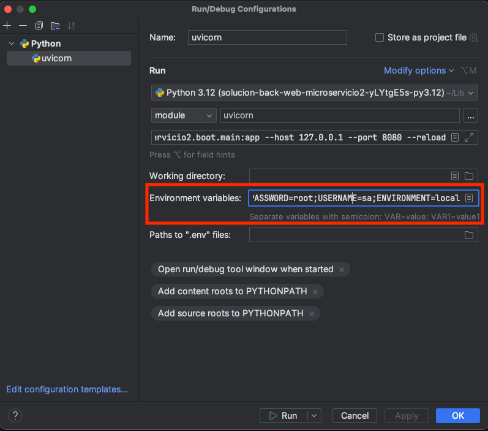

      - Configurando el path al fichero `.env:

          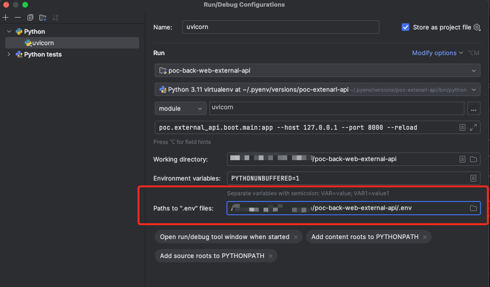
  
    - VSCode
      - Como variables individuales:
            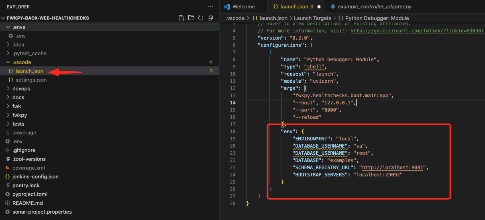
    
      - Desde el fichero `.env` en la raíz del proyecto:
            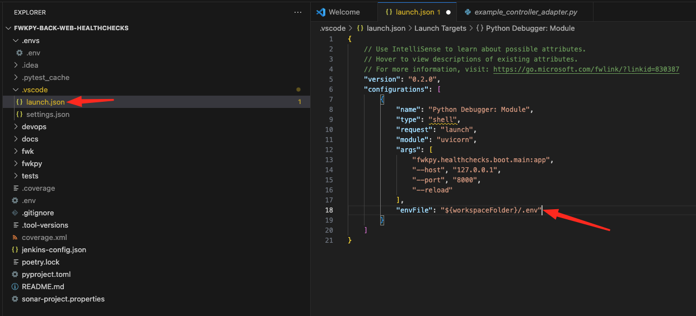

- Añadiéndolo al comando de uvicorn:
`alert_monitoring.api.boot.main:app --host 127.0.0.1 --port 8080 --reload --env-file .env`


## Arranque

Para arrancar el microservicio, se debe arrancar la aplicación a través de uvicorn usando el comando `uvicorn alert_monitoring.api.boot.main:app --host 127.0.0.1 --port 8080 --reload`.

Como uvicorn está instalado en el entorno virtual de Poetry, existen dos opciones:

1. Usando `poetry run`delante del comando, es decir, `poetry run uvicorn alert_monitoring.api.boot.main:app --host 127.0.0.1 --port 8080 --reload`
2. Activando el entorno virtual primero con el comando `poetry shell` y, a continuación, ejecutar el comando.

También es posible tener la configuración en el IDE arrancando con el módulo `uvicorn` y usando como parámetros `alert_monitoring.api.boot.main:app --host 127.0.0.1 --port 8080 --reload`. En caso de no tener disponible el input de parámetros, se debe activar desde el desplegable `Modify options`. 
Se puede añadir el path al fichero `.env` con las variables de entorno.

Con PyCharm
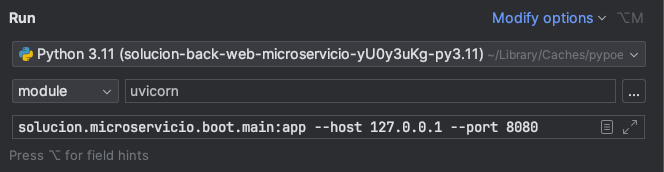

Con VSCode:
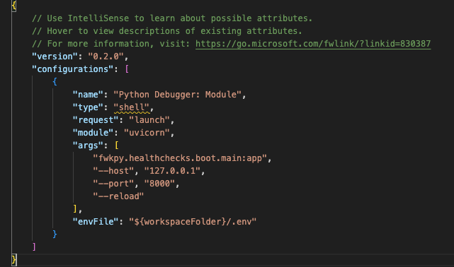

> **_WARNING:_**
> Si usas el agente en driven con conexión a un MCP, asegúrate de tener el MCP corriendo antes de arrancar la aplicación.

## Funcionalidades del framework

### Buenas prácticas

Desde el framework, se recomienda seguir una serie de buenas prácticas:

- [12 factor app](https://12factor.net/es/)
- [SOLID](https://es.wikipedia.org/wiki/SOLID)
- [PEP8](https://peps.python.org/pep-0008/)

### Configuración de la aplicación
La clase, `Settings`, encargada de cargar la configuración de los ficheros yaml, está en la libreria `fwkpy-lib-utils` que ya viene incluida en `fwkpy-lib-core`.

La configuración de la aplicación se carga dentro de `Settings.app_settings` en forma de diccionario anidado para cada nodo del yaml.

Los ficheros de configuración están en la carpeta `alert_monitoring/api/boot/resources`. Si es una configuración global, se debe generar la configuración en el archivo `application.yml`. En caso de ser una configuración de entorno, se deberá crear en `application-<ENTORNO>.yml`. En caso de tener un mismo valor en ambos ficheros, prevalecerá el de la configuración por entorno.

El path de estos ficheros se configura a través de la variable de entorno `FWK_PATH` que se genera automáticamente en el Dockerfile cuando se despliega. Para un entorno local, hay que setear manualmente como el resto de variables de entorno que necesita el arquetipo.
Más información sobre las variables de entorno en la [documentación del framework](https://fwk.srv.mercadona.com/framework/python?pathname=/latest/archetypes/web/)

Es posible cargar valores desde variables de entorno y secretos usando la nomenclatura `!ENV "${ENVIRONMENT_VARIABLE}"`

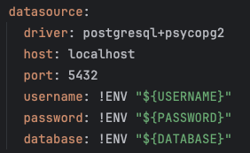

Estos ficheros son leídos por el framework y validados por la clase `Settings`. Para importar la configuración a la aplicación, se debe importar la clase `Settings`, generar una instancia nueva y acceder a la propiedad que se desee.


### Autoconfiguration
La libreria `fwkpy-lib-utils`, que ya viene incluida en `fwkpy-lib-core`, ofrece el decorador `@autoconfiguration`.

Este decorador se encarga de crear una instancia con las settings del yaml definidas en la clase de forma automática. 

Para usarlo, hay que extender la clase abstracta Autoconfigure, implementar el método `autoconfigure` y definir el nodo del yaml como parámetro del decorador.

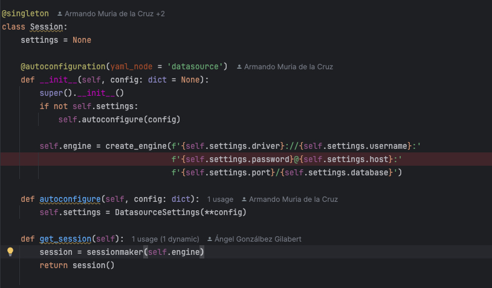

Se puede sobrescribir este comportamiento pasando el paárametro `config` con el diccionario de la configuración a cargar y el parámetro `autoconfigure=False` para que el decorador no haga nada.

Por ejemplo: `Session(config={"driver": "mongodb", "host": "localhost"}, autoconfigure=False)`


## Ajustes en las charts
Todos estos ajustes se hacen los ficheros `values-<entorno>.yaml` que se encuentran en la carpeta `devops/charts/env` proporcionado por el equipo de plataforma cuando generan el proyecto.

### Secrets

Los secrets se indican en el bloque `customSecret` de los yaml. Hay que tener en cuenta que los secrets cambian entre gke y ocp.
```yaml
python-app:
  customSecret:
    enabled: true
    mountAsVolume: true
    readOnly: true
    secretManager: gsm
    projectId: mdona-cloud-dev-fwkpy
    name: <nombre del volumen de secretos>
    mountPath: /var/run/secrets/
    data:
      - remoteSecret: <nombre remoto del secreto>
        k8sKey: <key del secreto>
    conjurAuthnLogin: host/dev-fwkpy
    conjurConnectConfigMap: conjur-cm
    serviceAccountName: conjur-sa
```

### Variables de entorno extraEnv
Para añadir variables de entorno a la hora de desplegar, hay que añadirlas en el bloque `extraEnv`.
Aquí se suele indicar las variables donde se añaden los secretos y el entorno, entre otras configuraciones que pueda necesitar el micro.

```yaml
python-app:
  extraEnv:
    - name: ENVIRONMENT
      value: dev
    - name: HOST
      valueFrom:
        configMapKeyRef:
          name: <key del configMap>
          key: bdp01
    - name: DATABASE
      value: <key del secreto>
    - name: USERNAME
      valueFrom:
        secretKeyRef:
          key: database-user
          name: <key del secreto>
    - name: PASSWORD
      valueFrom:
        secretKeyRef:
          key: database-password
          name: <key del secreto>
```

### GlobalContext
En la libreria `fwkpy-lib-utils`, que viene ya incluida en `fwkpy-lib-core`, hemos incluido una funcionalidad `GlobalContext` para gestionar variables en un contexto global.

Dicho contexto no se puede modificar directamente, hay que usar los métodos proporcionados en la clase `GlobalContext`.

Por ejemplo: `GlobalContext().set_var("<tu_variable>", "<tu_valor>")`

> **_WARNING:_**
> Esta funcionalidad está pensada para hacer llegar variables a las librerías desarrolladas o variables que no se puedan inyectar usando la inyección de dependencias.
>
> No se debe usar para saltarse la arquitectura hexagonal o para guardar configuraciones que ya han sido cargadas en la instancia de `Settings`.
>
> Para este último caso, ver como obtener la configuración en la sección de [`Settings`](#settings)


### Inyección de dependencias

Para la inyección de dependencias usamos una utilidad propia llamada `Injector` que viene proporcionada en `fwkpy-lib-core`. Ver [documentación](https://fwk.srv.mercadona.com/framework/python?pathname=/latest/concepts/dependency-injection/).

Para usar inyección de dependencias en los routers de FastAPI, se utiliza la clase `Depends` que proporciona `FastAPI` junto con `Injector.instance` de la librería `fwkpy-lib-core`. Ejemplo: `Depends(Injector.instance(ServicePort))`

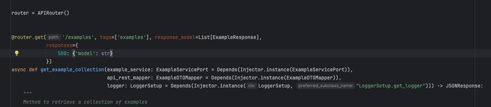

---

### i18N

Toda la configuración sobre i18N está en la libreria `fwkpy-lib-utils`.

En la librería, existen 4 métodos:

- `set_i18n`: establece la configuración inicial para la internacionalización. Tiene el parámetro opcional `locale`, para especificar el idioma por defecto de la aplicación. Si no se especifíca, se configurará en español.
- `load_translations`: carga las traducciones alojadas en una ruta específica. Tiene el parámetro `path`, que es la ruta donde se encuentran las traducciones.
- `set_locale`: modifica el idioma de la aplicación. Tiene el parámetro opcional `locale`, que será el idioma de la aplicación. Por defecto, será español.
- `get_message`: obtiene un mensaje según el idioma especificado en la aplicación. Tiene 2 parámetros, `file`, que es el nombre del fichero de donde queremos obtener el mensaje, y `key`, que será la clave de dicho fichero. Además, tiene el parámetro `**kwargs`, donde se puede especificar cualquier variable que se haya puesto en un mensaje.

La librería `fwkpy-lib-utils` ya tiene unas traducciones precargadas para las excepciones comunes. 
El path de las traducciones propias de la aplicación se configura en `alert_monitoring/api/boot/main.py` después de set_i18n()

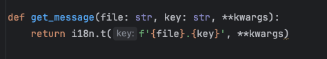

---

### Gestión de errores

Desde el framework se ofrece una gestión de errores dinámica y personalizable para hacer más ágil el desarrollo

#### Objeto de error - Error resource

En la carpeta `fwk/api_exception/models` existe el fichero `error_resource.py`, que contiene la clase `ErrorResource`, que será la encargada de mostrar la información del error.

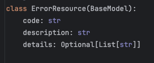

##### Objeto de error - Error resource response

En la carpeta `fwk/api_exception/models` existe el fichero `error_resource_response.py`, que contiene la clase `ErrorResourceResponse`, que es la clase que será devuelta por la aplicación, y que encapsula el objeto `ErrorResource`.

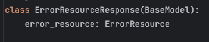

#### Mapper

En la carpeta `fwk/api_exception/mapper` se ubica el fichero `exception_mapper.py`, que contiene la clase `ExceptionMapper`, donde se inicializa un diccionario con el código HTTP que debe ser devuelto por cada excepción.


#### Builder

En la carpeta `fwk/api_exception/builder` se encuentran los builders de las excepciones. 

Tenemos dos ficheros, `exception_builder.py`, que se encarga de generar el objeto `ErrorResource` con los datos de la excepción.

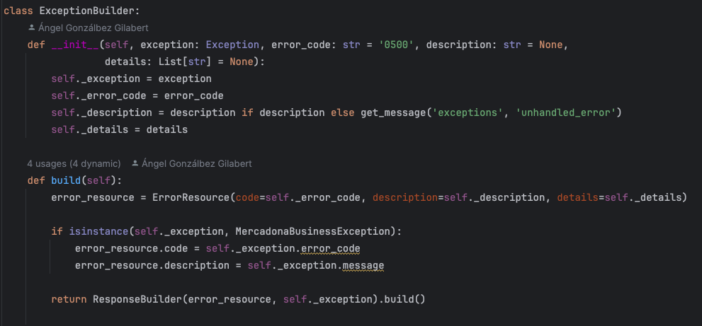

También existe el fichero `response_builder.py`, que recibe el objeto `ErrorResource` de `ExceptionBuilder`, busca en el `ExceptionMapper` el código HTTP que corresponde a dicha excepción, y genera la respuesta final.

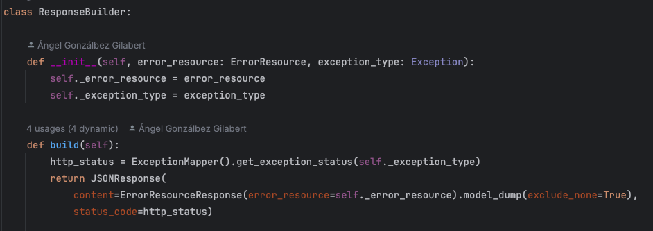

#### Handler

Están ubicados en la carpeta `fwk/api_exception/handler`. Se encargan de capturar las excepciones y pasarle la información a `ExceptionBuilder`.

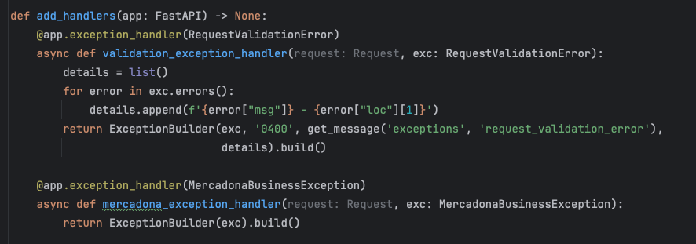

#### Excepciones

Se deben ubicar en la carpeta `fwk/api_exception`. Debe fijarse las propiedades `error_code` y `message`, obteniendo esta última desde el fichero de internacionalización.

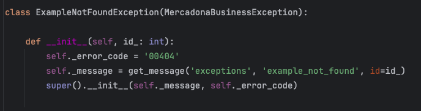

---

### Mappers
#### Objetos anidados
Los mappers se sitúan dentro de la carpeta `mappers` dentro de cada adaptador, tanto de entrada como de salida.

Existen 3 formas distintas de usar los mappers:

- Ad-hoc: se genera el objeto de salida especificando el valor campo por campo.

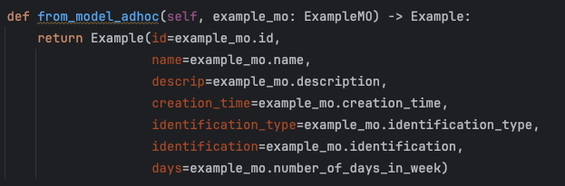

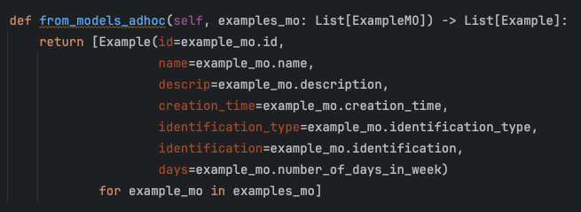

#### Usando el decorador

Este decorador, `@mapping` de la librería `fkwpy-lib-core`, admite como parámetro una lista de diccionarios, cuyo contenido debe ser `{'source': <NOMBRE_PROPIEDAD_ORIGEN>, 'target': <NOMBRE_PROPIEDAD_DESTINO>}`.

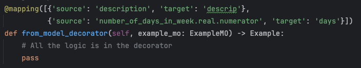

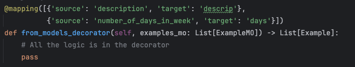

> **_NOTA:_** Es posible que, el atributo del objeto de destino no sea directamente el mismo que el de origen, sino un atributo de este.
> Por ello, es posible pasar atributos de un objeto en lugar del objeto completo usando la siguiente sintaxis:
> `@mapping([{'source': 'objeto.atributo.atributo', 'target': 'atributo'}])`

### Loggers
#### Etiquetas custom
Para añadir etiquetas custom al formatter de los loggers, tienes que indicarle las etiquetas y el valor por defecto al instanciar el logger.

Por ejemplo, añadir classname con valor por defecto vacío:
```python
LoggerSetup({"classname": ""})
```
Luego en el yaml de la aplicación hay que añadir la etiqueta:
```ymal
fwkpyt:
  logging:
    version: 1
    disable_existing_loggers: True
    formatters:
      verbose:
        format: '{"application": "alert-monitoring-back-web-api", "level": "%(levelname)s", 
        "classname": "%(classname)s", "date": "%(asctime)s", "thread": "%(thread)d", "message": "%(message)s", "module": "%(module)s"}'
```

### Health checks
> **_Nota:_**
> En el fwk Python no usamos los endpoints habituales de actuator/info o actuator/health y tampoco usamos pyctuator.
> Los health checks están implementados con una app de Starlette, compatible con FastAPI.

En el `main.py` se inicializa la app de los health checks y añaden a la app principal de FastAPI para que se expongan los endpoints correctamente.
Para más información, consultar la [documentación del framework](https://fwk.srv.mercadona.com/framework/python?pathname=/latest/libraries/fwkpy-lib-utils/#health-checks).

Los endpoints son `health-check/info` y `health-check/health`. Se configura en las charts de cada entorno.

Por defecto solo se obtiene información del micro sin realizar ninguna comprobación. Los checks para base de datos, kafka, etc se tienen que implementar en la 
librería o en el propio micro si se quiere alguna comprobación adicional, y añadirlos a la app de los health checks llamando al método 
`HealthChecksApp.add_health_check("<nombre del check>", <instancia de la clase que tiene el check>)`
Para más información, consultar la [documentación del framework](https://fwk.srv.mercadona.com/framework/python?pathname=/latest/libraries/fwkpy-lib-utils/#health-checks).

```yaml
python-app:
  probePath: /health-check/health
  livenessProbe:
    type: httpGet
    failureThreshold: 3
    httpGet:
      path: /health-check/info
      port: 8080
      scheme: HTTP
    initialDelaySeconds: 20
    periodSeconds: 10
    successThreshold: 1
    timeoutSeconds: 3
  readinessProbe:
    type: httpGet
    failureThreshold: 3
    httpGet:
      path: /health-check/health
      port: 8080
      scheme: HTTP
    initialDelaySeconds: 20
    periodSeconds: 10
    successThreshold: 1
    timeoutSeconds: 3
```


Si se usa la version 2.0 de las charts (`devops/<nombre del micro>/requirements.yaml`), hay que añadir una variable de entorno más en el bloque del envoy:
```yaml
python-app:
  ...
  envoy:
    ...
    env:
    - name: O2E_UPSTREAM_HEALTHCHECK_PATH
      value: "/health-check/health"
    ...
```